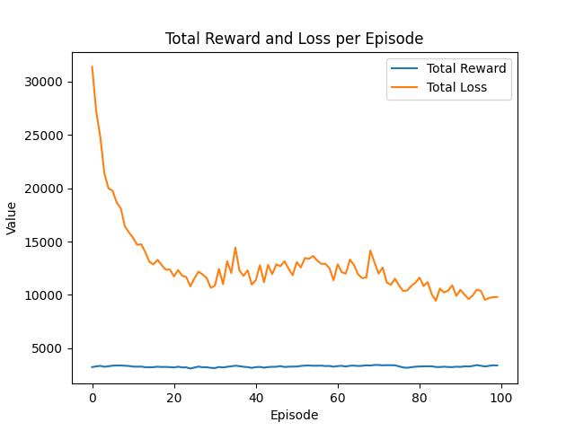

# [](https://ko-fi.com/R6R8QT94J) Simple RL-LSTM

## Overview

This project provides a comprehensive demonstration of training a Long Short-Term Memory (LSTM) model using Reinforcement Learning (RL) with PyTorch. The project is meticulously organized into distinct components, including a custom agent, environment, and model, to enhance readability and maintainability. By generating a random dataset, the model is trained to identify sequences where the sum of the current datapoint and the preceding datapoint exceeds a value of 3. This fictive training scenario serves as an illustrative example of how to effectively train an LSTM using RL techniques.

For more high-level details about the project, you can read this [article](https://medium.thekroll.ltd/practical-application-of-reinforcement-learning-with-lstm-and-pytorch-a-simple-solution-for-a-1578d56a5a49) where i share some more insights.



## Project Structure

The project is organized into the following directories and files:

- `agent/`
  - `__init__.py`: Package initialization file.
  - `triple_action_agent.py`: Defines the `TripleActionAgent` class, which uses an LSTM model for action selection and learning.

- `environment/`
  - `__init__.py`: Package initialization file.
  - `simple_env.py`: Defines the `SimpleEnv` class, which represents a custom environment for the agent to interact with.

- `model/`
  - `__init__.py`: Package initialization file.
  - `lstm.py`: Defines the `LSTMModel` class, which implements the LSTM neural network.

- `run.py`: The main entry point for running the project. It contains the training and testing logic for the agent.

- `README.md`: This documentation file.

- `requirements.txt`: Lists the project's dependencies, which can be installed using a package manager like pip.

- `rewards_and_losses_per_episode.png`: A plot showing the total rewards and losses per episode during training.

## Key Components

### TripleActionAgent

The `TripleActionAgent` class is a reinforcement learning agent that uses an LSTM model to select actions and learn from experiences. It follows an ε-greedy policy for action selection and uses Q-learning for training.

### SimpleEnv

The `SimpleEnv` class represents a custom environment for the agent to interact with. It provides methods for resetting the environment, taking steps, and calculating rewards.

### LSTMModel

The `LSTMModel` class implements a Long Short-Term Memory (LSTM) neural network. It consists of an LSTM layer and a fully connected layer for predicting Q-values.

### run.py

The `run.py` file contains the main logic for training and testing the agent. It initializes the environment and agent, runs the training loop, and evaluates the agent's performance.

## How to Run

### Prerequisites

- Python 3.12 or higher installed

1. Install the required dependencies:
   ```bash
   pip install -r requirements.txt

2. Run the training and testing script:
   ```bash
    python run.py
